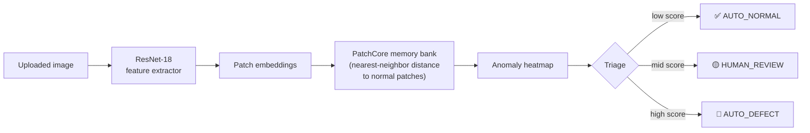
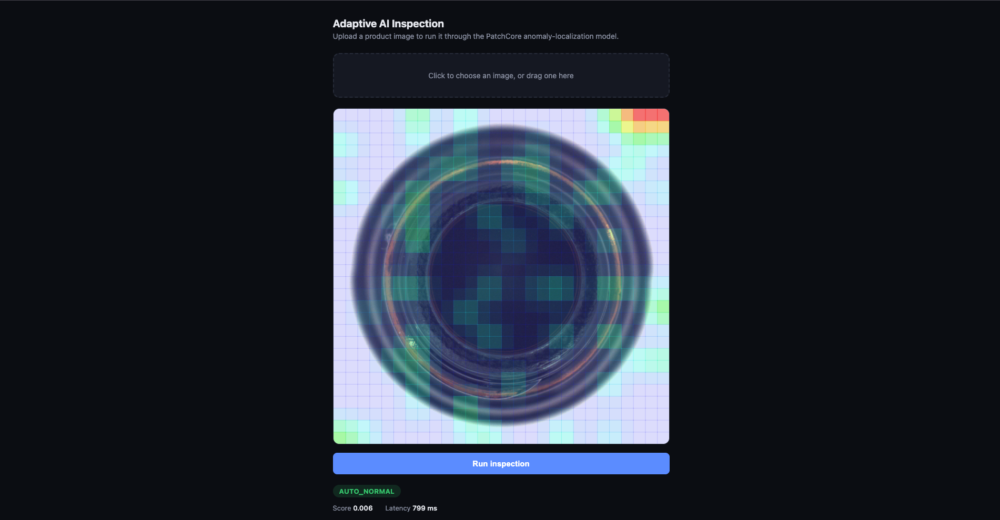
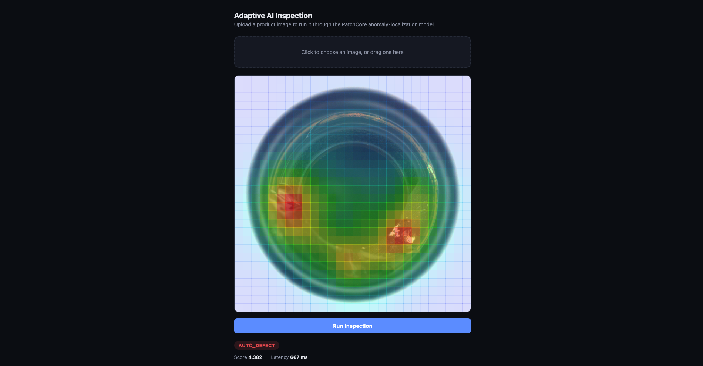
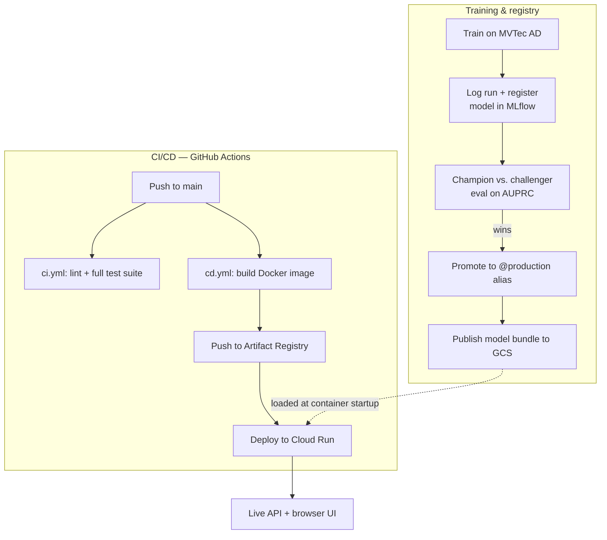

# Adaptive AI Inspection

An industrial defect-detection system that localizes anomalies on images (not just "pass/fail"), ships behind a real API, and runs on a real cloud deployment with its own CI/CD pipeline.

[](https://github.com/ayush-chauhan-1202/adaptive-ai-inspection/actions/workflows/ci.yml)
[](https://github.com/ayush-chauhan-1202/adaptive-ai-inspection/actions/workflows/cd.yml)

## Try it live

**[https://adaptive-ai-inspection-tjk4m6eu4q-uc.a.run.app](https://adaptive-ai-inspection-tjk4m6eu4q-uc.a.run.app)** — upload an image, get an anomaly heatmap and a decision back in your browser.

(It's on Cloud Run's free tier, which scales to zero when idle — the first request after a quiet period can take a few seconds to cold-start. Everything after that is fast.)

## What this is

Most "AI inspection" demos stop at image classification on a clean, balanced dataset. This project was built to survive the constraints that actually show up on a factory floor:

- Defects are rare, so there's rarely enough labeled defect data to train a conventional classifier.
- A model needs to flag defect *types it never saw in training*, not just the ones in its training set.
- A wrong "pass" is far more expensive than a wrong "needs review" — the system should know what it doesn't know.
- It needs to run as a real service other systems can call, not just a notebook.

The result is a patch-based anomaly localization pipeline (PatchCore-style), served through a FastAPI backend, tracked and versioned through MLflow, containerized, and deployed to Google Cloud Run through a GitHub Actions pipeline — trained and validated on the [MVTec AD](https://www.mvtec.com/company/research/datasets/mvtec-ad) industrial dataset.

## How it works



The model never learns "what a defect looks like" — it only learns what *normal* looks like, from a bank of patch embeddings taken from known-good images. Anything that doesn't resemble a nearby normal patch lights up on the heatmap. That's what lets it catch defect types it has never explicitly seen before.

## Results

A real request/response from the live service, shown through the browser UI — not a mocked screenshot:

<p align="center">
  
</p>
<p align="center"><em>Normal part — score 0.004, classified AUTO_NORMAL, 709ms end-to-end on Cloud Run.</em></p>

<p align="center">
  
</p>
<p align="center"><em>Defective part — the heatmap localizes the break, classified AUTO_DEFECT.</em></p>

## Engineering highlights

A few real problems this project surfaced, and how they were actually solved (not glossed over):

- **Found a genuine bug inside MLflow itself.** The production model failed to load from Cloud Storage with a cryptic 404. Traced it past this project's own code into MLflow 3.16.1's GCS artifact-loading logic — an off-by-one in how it splits a bare `gs://bucket/path` URI — confirmed by reading the installed library's source and MLflow's own GitHub history, not by guessing. Worked around with a trailing-slash path convention, documented so the next person doesn't have to re-derive it.
- **Root-caused a cloud OOM instead of just throwing more RAM at it.** The deployed service was getting killed on Cloud Run with out-of-memory errors. Scaling memory up (2Gi → 4Gi → 8Gi → 16Gi) made it *run*, but that's a band-aid, not a fix — so the real cause got found: the anomaly-scoring code was materializing a full dense `(queries × memory-bank-size × channels)` tensor in memory before reducing it, which scales into multiple gigabytes by design. Rewrote it as a single BLAS matrix multiply using the `‖a−b‖² = ‖a‖² + ‖b‖² − 2·a·b` identity — mathematically identical output (verified bit-for-bit against the old implementation), **8x less memory and ~7x lower latency** (17s → 2.2s), and the service now runs comfortably on the original 2Gi/2vCPU Cloud Run default.
- **Keyless cloud deploys.** GitHub Actions authenticates to GCP via Workload Identity Federation — no long-lived service-account JSON keys sitting in repo secrets.
- **Config lives in code, not in someone's terminal history.** Every manual `gcloud` fix made while debugging was folded back into `cd.yml` and verified through an actual pipeline run, so the next deploy can't silently undo a fix that only existed as a live patch.

## Under the hood: training → production



## Milestones

| # | Milestone | Status |
|---|---|---|
| 0 | Problem definition & architecture | ✅ Done |
| 1 | Classical anomaly-detection baseline | ✅ Done |
| 2 | Deep-learning baseline (learned embeddings) | ✅ Done |
| 3 | PatchCore-style patch localization | ✅ Done |
| 4 | Validation on unseen/rare defect types | ✅ Done |
| 5 | Human-in-the-loop triage (auto-pass / review / auto-fail) | ✅ Done |
| 6 | MLOps foundation — FastAPI, Docker, MLflow tracking & registry | ✅ Done |
| 7 | Production inference + cloud deployment (GCP Cloud Run) | ✅ Done |
| 8 | CI/CD — automated lint, test, build, deploy (GitHub Actions) | ✅ Done |
| 9 | Monitoring — Prometheus metrics, structured logs | ✅ Done |
| 10 | Continuous improvement — retrain/promote loop | 🟡 Scaffolded (manual trigger today) |

<details>
<summary><strong>Expand for milestone-by-milestone detail</strong></summary>

**0 — Problem definition & architecture.** Scoped the problem around real factory constraints (rare defects, unseen defect types, asymmetric cost of mistakes) rather than a clean benchmark setup, and laid out the system architecture up front.

**1 — Classical anomaly-detection baseline.** Established a non-deep-learning baseline to validate the problem framing before investing in heavier models.

**2 — Deep-learning baseline.** Moved to learned feature embeddings (ResNet-based) as a stronger, more general representation of "normal."

**3 — PatchCore-style localization.** Replaced whole-image scoring with patch-level comparison against a memory bank of normal patches, enabling localization (*where* the defect is) rather than a single pass/fail score.

**4 — Unseen/rare defect validation.** Validated that the memory-bank approach generalizes to defect types not present during training — the core requirement that rules out a standard supervised classifier.

**5 — Human-in-the-loop triage.** Added a three-way decision band (AUTO_NORMAL / HUMAN_REVIEW / AUTO_DEFECT) instead of a binary cutoff, so uncertain cases get routed to a person rather than silently guessed.

**6 — MLOps foundation.** Built the FastAPI serving layer, Dockerized the service, and wired up MLflow for experiment tracking and model registry (versioning, aliasing, promotion).

**7 — Production inference + cloud deployment.** Deployed to Google Cloud Run, loading the production model directly from Cloud Storage via its MLflow registry alias. Debugged and permanently fixed two real production issues along the way — see *Engineering highlights* above.

**8 — CI/CD.** `ci.yml` runs lint + the full test suite on every push; `cd.yml` builds the Docker image, pushes it to Artifact Registry, and deploys to Cloud Run — authenticated keylessly via Workload Identity Federation.

**9 — Monitoring.** Prometheus metrics (`/metrics`) and structured logging on every request, so latency and decision distribution are observable in production.

**10 — Continuous improvement.** The retrain → re-register → promote path exists and has been exercised manually; a fully automatic trigger (e.g. on a drift signal or a schedule) is the one piece intentionally left as a documented next step rather than implemented pre-emptively.

</details>

## Repository structure

```
.
├── src/
│   ├── inspection/
│   │   ├── api/            FastAPI app — /inspect, /health, /version, /metrics, browser UI
│   │   └── localization/   PatchCore feature extraction + patch memory bank
│   └── ...
├── tests/                  Full pytest suite, run on every push via ci.yml
├── configs/                Training / pipeline configuration
├── scripts/                 Training, evaluation, and registry-promotion scripts
├── docs/
│   ├── architecture.md     Deeper system design writeup
│   └── images/              README screenshots
├── .github/workflows/
│   ├── ci.yml               Lint + test
│   └── cd.yml                Build → push → deploy to Cloud Run
├── Dockerfile
├── docker-compose.yml       Local API + MLflow UI
└── RUNBOOK.md                Operational runbook (local + production)
```

## Running it locally

```bash
docker compose up -d
```

- Browser UI + API: `http://localhost:8080`
- MLflow UI: `http://localhost:5000`

Full setup, environment variables, and troubleshooting are in [`RUNBOOK.md`](RUNBOOK.md). System design detail is in [`docs/architecture.md`](docs/architecture.md).

## Development philosophy

- Build for the constraint that actually matters (rare + unseen defects), not the easiest benchmark to beat.
- A workaround that makes something run isn't the same as a fix — root cause before closing an issue.
- If a fix only exists as a manual command in someone's terminal history, it isn't really fixed — it goes back into the pipeline config.
- Verify with real output (real logs, real API responses, real test runs), not assumption.

## Current status

The full pipeline is live end-to-end: train → track/register in MLflow → serve via FastAPI → containerize → deploy to Cloud Run → CI/CD on every push, with a browser UI on top so the result is checkable without any tooling. The two production issues this surfaced (an upstream MLflow bug and a memory/latency inefficiency in the scoring code) were root-caused and permanently fixed rather than patched around — see *Engineering highlights* above for both. The one open item is milestone 10's automatic retrain trigger, which today is a manual, tested path rather than a scheduled/event-driven one.